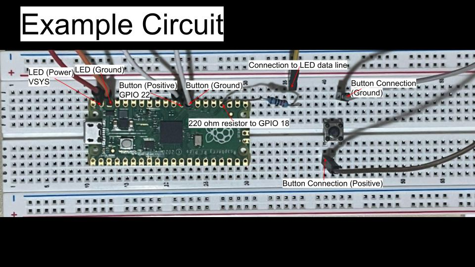

<h4 align="center">Interacting with a WS2812 Neopixel LED board.</h4>

 

  <iframe width="600" height="338" 
          src="https://www.youtube.com/embed/ed-fL5peNKo" 
          frameborder="0" 
          allow="accelerometer; autoplay; clipboard-write; encrypted-media; gyroscope; picture-in-picture" 
          allowfullscreen>
  </iframe>

## About the Project

This project demonstrates how to interact with a WSS2812 LED array by creating various displays using a Raspberry Pi Pico Microcontroller. The mode displayed on the LED board can be changed by pressing a button connected to the Pico. 

1. **Hardware Required**
    - Raspberry Pi Pico Microcontroller
        - https://www.adafruit.com/pico?src=raspberrypi
    - Breadboard
        - 7 Jumper Wires, explained below
        - 220 ohm - 330 ohm resistor for LED din connection
        - Button Switch to change modes
    - WS2812 Neopixel LED Array Board
        - https://www.amazon.com/dp/B07PB2P81N/ref=twister_B07P5TNCHP?_encoding=UTF8&th=1
2. **Setting up the Hardware**
<table>
    <tr>
        <td> 
    </tr>
    <tr>
        <td> An example circuit used to connect the WS2812 LED array using a breadboard and the Pico microcontroller. To see valid GPIO pins for the LED Array refer to the Raspberry Pi Pico datasheet. Ensure that your pins are mapped correctly in <a href="lib/src/pins.h">pins.h</a> for BUTTON and ws2812.</td>
    </tr>
</table>

